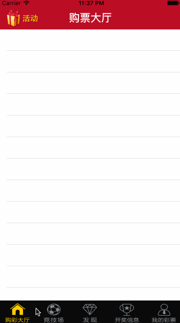

# Litter_Lottery

####在原来的基础上面加入3DTouch

xcode7是支持`3D Touch`开发的，可是模拟器并不支持这个手势，我们只能在真机上进行学习与测试，但是在IT的世界，从来都不缺拯救世界的人物，github上有人为我们提供了这样的一个插件，可以让我们在模拟器上进行3D Touch的效果测试：

git地址：[SBShortcutMenuSimulator](https://github.com/DeskConnect/SBShortcutMenuSimulator)至于怎么玩就看大家自己了

